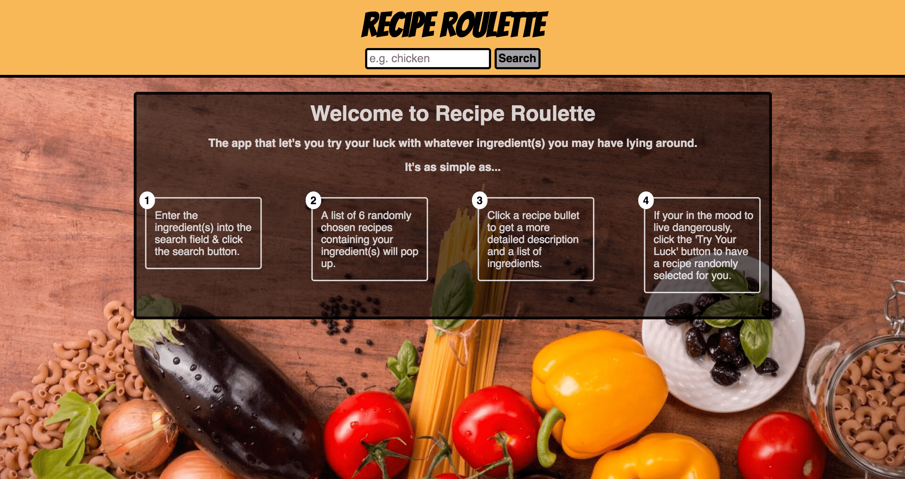
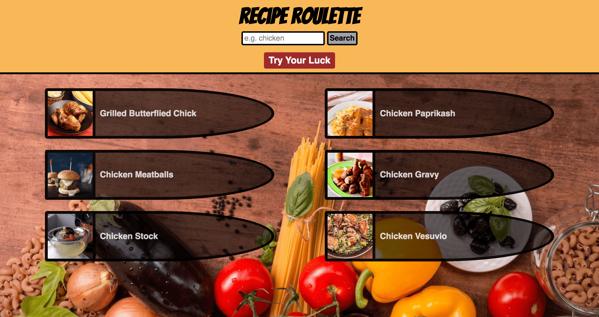
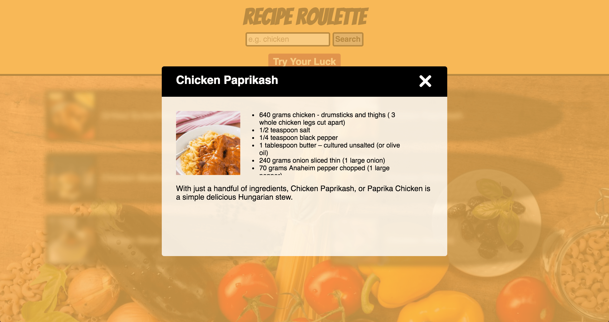

# Recipe Roulette

A recipe application that helps users find recipes which contain ingredient(s) that they already have on hand. Recipe search results are narrowed down to a select handful and users have the option to have a single recipe chosen for them at random.

## Demo

- [Live Demo](https://mike-crane.github.io/recipe-roulette/)

## Motivation

I was looking for a quick and easy way to pick a recipe based on the ingredients I already had on hand and thought it would be fun to add a ’Russian roulette’ twist to it. 

## Screenshots

Landing Page:

Search Results Page:

Recipe Details Modal:

## Built With

* HTML
* CSS
* JavaScript
* jQuery
